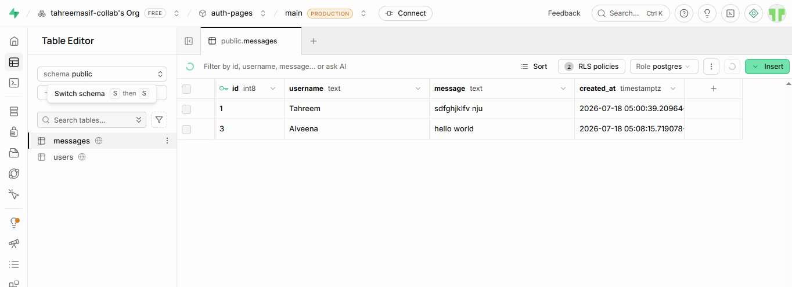

# 💬 Realtime Chat App

A modern Realtime Chat Application built with **React, Vite, and Supabase Realtime**. This application allows users to send and receive messages instantly without refreshing the page.

---

## 🚀 Features

- ⚡ Realtime messaging with Supabase Realtime
- 💬 Send and receive messages instantly
- 📜 Display previous chat history
- 👤 Username support
- ⏰ Message timestamp
- 🎨 Modern and responsive UI
- 🔄 Automatic updates without page refresh
- 📱 Responsive design for desktop and mobile

---

## 🛠️ Tech Stack

- React.js
- Vite
- JavaScript (ES6)
- CSS3
- Supabase
- Supabase Realtime

---

## 📂 Project Structure

```
realtime-chat/
│
├── public/
│
├── src/
│   ├── components/
│   │   ├── Chat.jsx
│   │   ├── MessageInput.jsx
│   │   ├── MessageList.jsx
│   │   └── MessageItem.jsx
│   │
│   ├── styles/
│   │   └── Chat.css
│   │
│   ├── supabase.js
│   ├── App.jsx
│   ├── App.css
│   ├── index.css
│   └── main.jsx
│
├── .env
├── package.json
├── vite.config.js
└── README.md
```


## OUTPUT





---

## 📦 Installation

Clone the repository

```bash
git clone <repository-url>
```

Move into the project folder

```bash
cd realtime-chat
```

Install dependencies

```bash
npm install
```

Start the development server

```bash
npm run dev
```

---

## 🔑 Supabase Setup

Create a `.env` file in the project root.

```env
VITE_SUPABASE_URL=YOUR_SUPABASE_URL
VITE_SUPABASE_ANON_KEY=YOUR_SUPABASE_ANON_KEY
```

---

## 🗄️ Database Table

Create a table named **messages**.

```sql
create table messages (
  id bigint generated always as identity primary key,
  username text not null,
  message text not null,
  created_at timestamp default now()
);
```

Enable **Realtime** for the `messages` table from the Supabase Dashboard.

---

## ▶️ How It Works

1. User enters their name.
2. User types a message.
3. Clicking the **Send** button stores the message in Supabase.
4. Supabase Realtime broadcasts the new message.
5. Every connected user instantly receives the new message without refreshing the page.

---

## ✨ Key Features

- Realtime Subscriptions
- Live Chat
- Fetch Previous Messages
- React Hooks (useState, useEffect, useRef)
- Responsive User Interface
- Component-Based Architecture
- Modern Gradient Design
- Auto Scroll to Latest Message

---

## 📚 Learning Outcomes

- React Components
- React Hooks
- Supabase Integration
- Realtime Database
- CRUD Operations
- State Management
- Component Communication
- Responsive CSS Design

---

## 👩‍💻 Author

**Tahreem Asif**

BS Computer Science Student

COMSATS University Islamabad, Vehari Campus

---

## 📜 License

This project is created for learning and educational purposes.