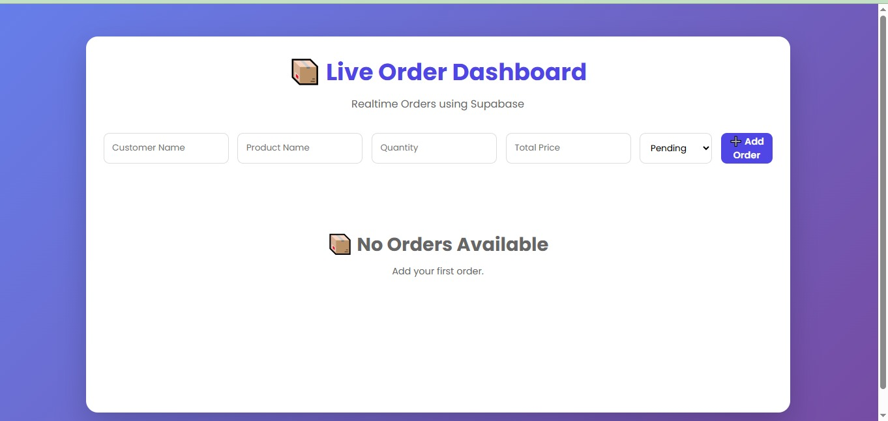
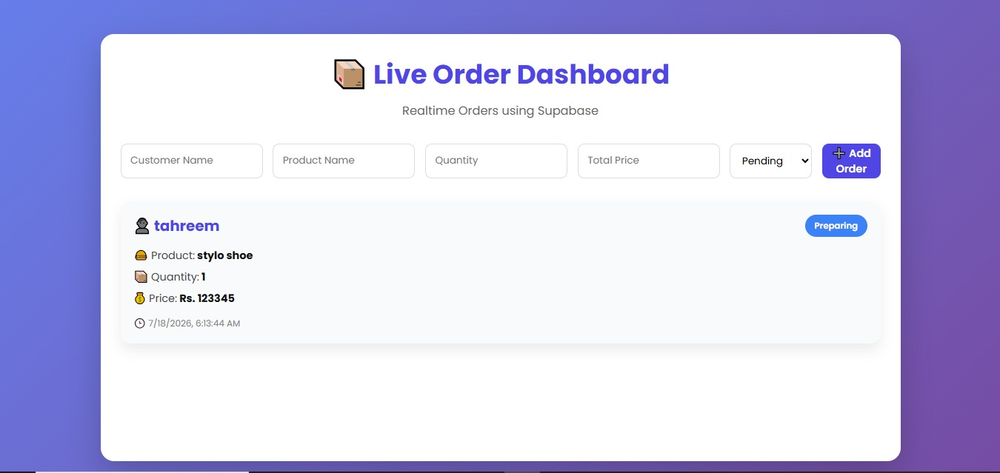
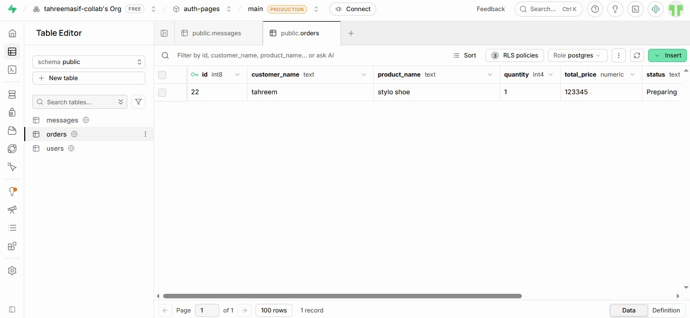

# 📦 Live Order Dashboard

A modern **Live Order Dashboard** built using **React, Vite, and Supabase Realtime**. This application allows users to add, view, and monitor orders in real time. Any new order added to the database instantly appears on the dashboard without refreshing the page.

---

## 🚀 Features

- 📦 Add New Orders
- ⚡ Realtime Order Updates
- 🔄 Automatic Dashboard Refresh
- 👤 Customer Name
- 🛍️ Product Name
- 🔢 Quantity
- 💰 Total Price
- 📋 Order Status (Pending, Preparing, Delivered)
- 🕒 Order Timestamp
- 🎨 Modern Responsive UI

---

## 🛠️ Tech Stack

- React.js
- Vite
- JavaScript (ES6)
- CSS3
- Supabase
- Supabase Realtime

---

## 📂 Project Structure

```
live-order-dashboard/
│
├── public/
│
├── src/
│   ├── components/
│   │   ├── Dashboard.jsx
│   │   ├── OrderForm.jsx
│   │   ├── OrderList.jsx
│   │   └── OrderCard.jsx
│   │
│   ├── styles/
│   │   └── Dashboard.css
│   │
│   ├── supabase.js
│   ├── App.jsx
│   ├── App.css
│   ├── index.css
│   └── main.jsx
│
├── .env
├── package.json
├── vite.config.js
└── README.md
```


## OUTPUT







---

## 📦 Installation

Clone the repository:

```bash
git clone <repository-url>
```

Move into the project folder:

```bash
cd live-order-dashboard
```

Install dependencies:

```bash
npm install
```

Run the development server:

```bash
npm run dev
```

---

## 🔑 Supabase Configuration

Create a `.env` file in the project root.

```env
VITE_SUPABASE_URL=YOUR_SUPABASE_URL
VITE_SUPABASE_ANON_KEY=YOUR_SUPABASE_ANON_KEY
```

---

## 🗄️ Database Schema

Create the `orders` table in Supabase:

```sql
create table orders (
  id bigint generated always as identity primary key,
  customer_name text not null,
  product_name text not null,
  quantity int not null,
  total_price numeric not null,
  status text default 'Pending',
  created_at timestamp default now()
);
```

Enable **Realtime** for the `orders` table from the Supabase Dashboard.

---

## ▶️ How It Works

1. Enter customer name.
2. Enter product name.
3. Enter quantity and total price.
4. Select the order status.
5. Click **Add Order**.
6. The order is saved in Supabase.
7. The dashboard updates instantly using Supabase Realtime without refreshing the page.

---

## ✨ Key Features

- Realtime Dashboard
- Live Order Tracking
- Supabase Database Integration
- React Hooks (useState & useEffect)
- Realtime Subscriptions
- Responsive Design
- Component-Based Architecture
- Modern User Interface

---

## 📚 Learning Outcomes

- React Components
- React Hooks
- State Management
- Supabase CRUD Operations
- Supabase Realtime
- Realtime Data Synchronization
- Responsive UI Design
- Database Integration

---

## 👩‍💻 Author

**Tahreem Asif**

BS Computer Science Student

COMSATS University Islamabad, Vehari Campus

---

## 📜 License

This project was developed for learning and educational purposes.